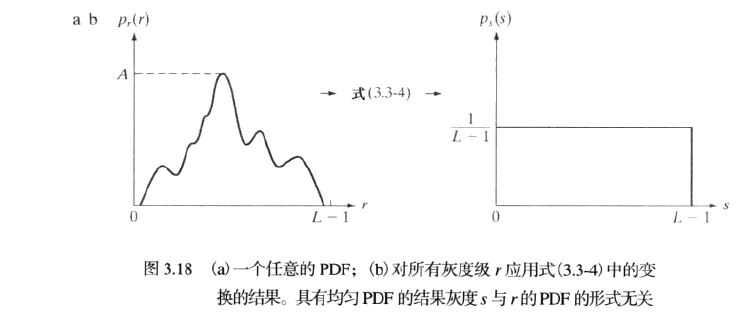
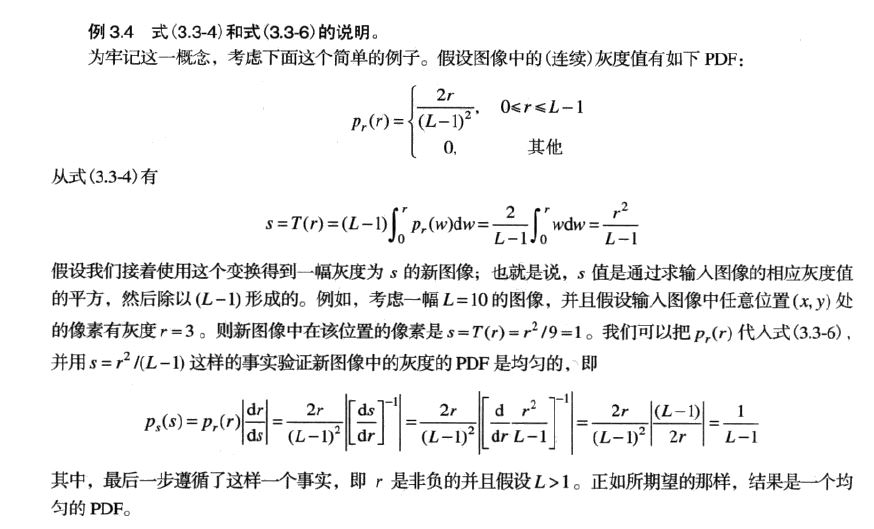
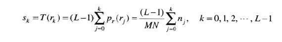
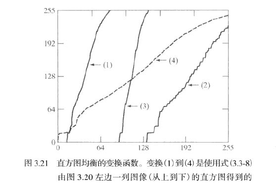
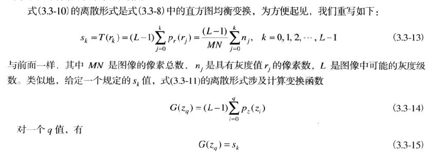
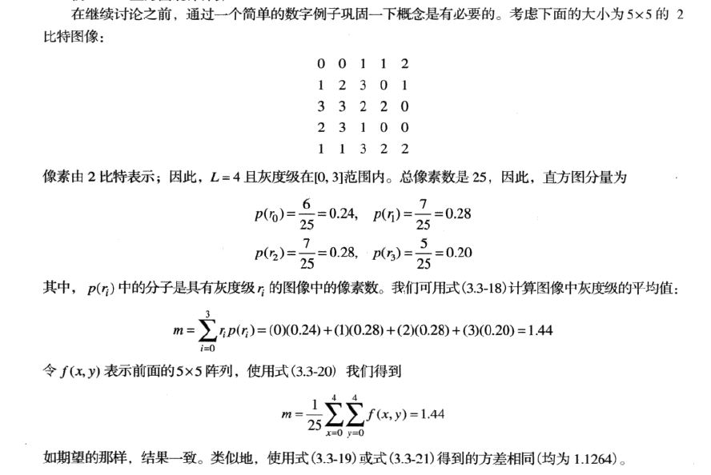
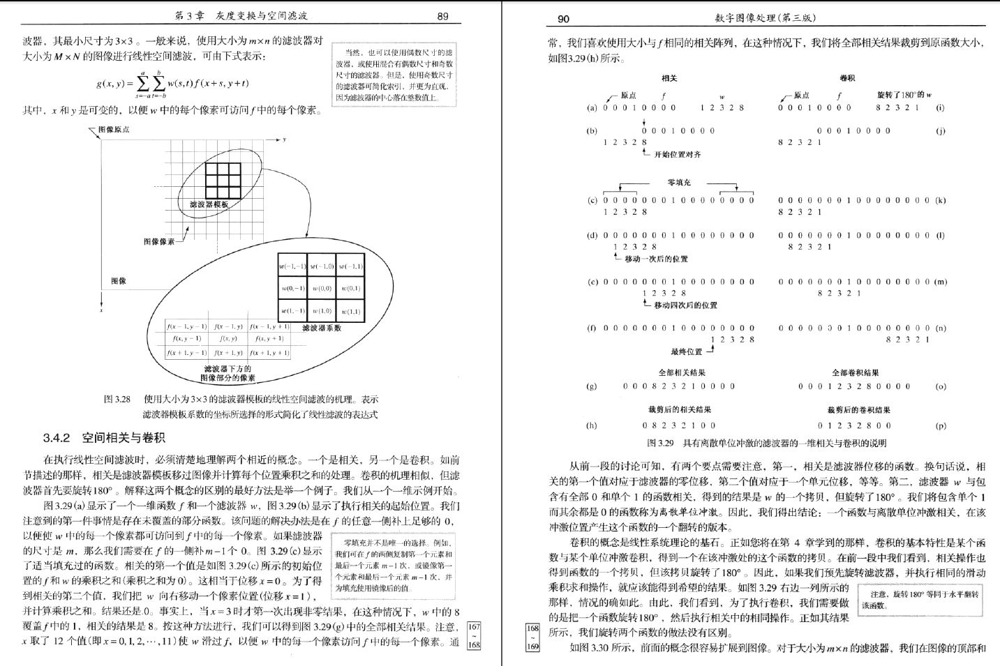

引言
===
        1. 空间域：平面本身，直接操作图像中的像素
        2. 变换域：先把一幅图像变换到变换域，在变换域进行处理，然后通过反变换把处理结果返回到空间域
        3. 空间域的处理主要分为：灰度变换和空间滤波
        4. 灰度变换在图像的单个像素上操作，以对比度和阈值处理为目的
        5. 空间滤波涉及改善性能的操作，如通过图像中的每一个像素的邻域来锐化图像

背景知识
===

灰度变换和空间滤波的基础
---

        1. 在空间域
        2. g(x,y)=T[f(x,y)]
        3. 图3.1的计算过程见书63页
        4. 空间滤波，邻域与预定义的操作称为空间滤波器，在邻域中执行的操作类型决定了滤波处理的特性
一些基本的灰度变换函数
===

        1. 图像反转 s=L-1-r
        2. 对数变换 s=clog(1+r)：将输入中范围较窄的低灰度值映射为输出中较宽范围的灰度值，可以用来①：扩展图像中的暗像素的值，同时压
        缩更高灰度级的值。②：压缩像素值变化较大的图像的动态范围
        3. 幂律（伽马）变换 s=cr**γ(c、γ正常数) 伽马校正
        4. 分段线性变换函数
                1. 对比度拉伸：扩展图像灰度级动态范围的处理
                2. 灰度级分层：突出特定范围的亮度
                        1. 感兴趣范围内的所有灰度值显示为一个值，其他灰度值为令一个值
                        2. 感兴趣范围的灰度变亮（暗），保持图像中的其他灰度值不变
                3. 比特平面分层：像素是由比特组成的数字
直方图处理
===
        1. 各个灰度值所占比例
        2. 用于图像增强，灰度变换
        3. 低对比度图像具有较窄的直方图，且集中于灰度级的中部

直方图均衡
 ---
        一、连续灰度
                1. 变量r表示待处理图像的灰度，r的取值[0,L-1]，r=0黑色，r=L-1白色。灰度映射，s=T(r),0 <= r <= L-1
                   a) T(r)在区间0 <= r <= L-1上为单调递增函数,保证输出灰度值不少于相应的输入值，防止产生缺陷
                   b) 当0 <= r <= L-1时，0 <= T(r) <= L-1,保证输出范围与输入范围相同
                   a') T(r)在区间0 <= r <= L-1上是严格单调递增函数,保证从结果到输入是一对一的关系
           
                2. 随机变量的基本描述子是其概率密度函数（PDF）,令pr(r)，ps(s)分别表示随机变量r和s的概率密度函数
                   如果pr(r)和T(r)已知，且在感兴趣的值域T(r)上是连续且可微的，则变量s的PDF，ps(s)=pr(r)|dr/ds|
                   即输出灰度变量s的PDF就由输入灰度的PDF和所用的变换函数计算得出。
        
        

                3. w是积分的假变量，公式右边是随机变量r的累积分布函数(CDF)
                4. 在该等式中上限是r=(L-1)时，则积分值等于1（PDF曲线下方的面积总是1，所以s的最大值为（L-1））

        二、离散值
                1. 处理其概率（直方图值）与求和来代替处理概率密度函数与积分

直方图匹配（规定化）
---
        1. 用于产生处理后有特殊直方图的方法称为直方图匹配或直方图规定化

        2. 一幅给定图像得到一幅灰度级具有指定概率密度函数的图像
           a) 由输入图像得到pr(r),并由式(3.3-10)求得s的值
           b) 使用式(3.3-11)中指定的PDF求得变换函数G(z)
           c) 求得反变换函数z=G-1(s)，因为z是由s得到的，所以该处理是s到z的映射
           d) 首先用式(3.3-10)对输入图像进行均衡得到输出图像；该图像的像素值是s值。对均衡后的图像中具有s值的每个像素执行
           反映射z=G-1(s)，得到输出图像中的相应像素。当所有图像处理完后，输出图像的PDF等于指定的PDF

        3. 离散形式直方图规定化过程
           a) 计算给定图像的直方图pr(r)
        
       

直方图均衡与直方图匹配的比较
---
        1. 直方图规定化大部分是试凑过程

局部直方图处理
---
        1. 以每个像素的邻域中的灰度分布为基础设计变换函数

在图像增强中使用直方图统计
---
        1. 方差（标准差）是图像对比度的度量
        2. 在仅处理均值和方差时，实际上直接通过从取样值来估计他们，而不必计算直方图，这些估计称为取样均值和取样方差
        3. 一幅图像的平均灰度可以由求所有像素的灰度值之和，并用图像中的像素总数去除而得到

        
        4. 局部均值和方差是根据图像中每一像素的邻域内的图像特征进行改变的基础
        5. 判断一个区域在点(x,y)是暗还是亮的方法是把局部平均灰度与全局均值的平均灰度进行比较
        6. 满足局部增强所有条件的一个位于点(x,y)处的像素，可简单通过将像素值乘以一个指定的常数F来处理，以便相对于图像的
        其他部分增大（或减小）其灰度值，不满足增强条件的像素则保持不变

空间滤波基础
===
        1. 滤波指接受或拒绝一定的频率分量。通过低频的滤波器称为低通滤波器，低通滤波器的最终效果是模糊（平滑）一幅图像
        
空间滤波机理
---
        1. 空间滤波器由一个邻域，对该邻域包围的图像像素执行的预定义操作组成，滤波产生新的像素，新像素的坐标等于邻域中心
        的坐标
        2. 线性空间滤波器、非线性空间滤波器

空间相关与卷积
---
        1. 相关：滤波器模板移过图像并计算每个位置乘积之和的处理
        2. 卷积：滤波器首先旋转180°

        3. 离散单位冲激：包含单个1而其余是0的函数
        4. 一个函数与离散单位冲激相关，在该冲激位置产生这个函数的一个翻转的版本
        5. 卷积的基本特性是某个函数与某个单位冲激，得到一个在该冲激处的这个函数的拷贝
        6. 将上述相关、卷积的概念扩展到图像。对于大小为m x n的滤波器，上下左右填充0

