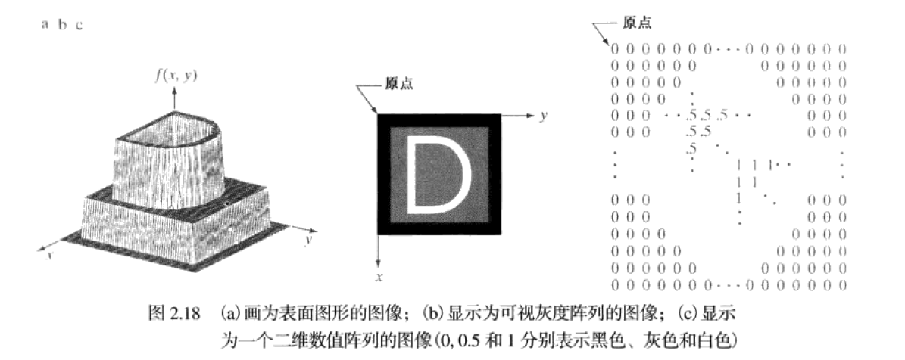

视觉感知要素：
===

	#：数字图像处理建立在数学和概率公式上

图像取样与量化：
---
	前面多种获取图像的方法的目的就是从感知的数据生成数字图像。
	1. 基本概念：一幅图像的x和y坐标可能都是连续的，为了将图像转成数字形式，必须在坐标上和幅度上进行取样操作。
	对坐标值进行数字化称为取样，对幅值数字化称为量化。
	

	1. 图(b)的一维函数，是从图(a)中沿着AB的连续图像幅度值（灰度级）的曲线
	2. 随机变化是由于图像噪声引起
	3. 沿线段AB等间隔取样

	空间取样：通过选择各个机械增量的数量并在取样处激活传感器来搜集数据完成的

数字图像表示：
===
	令f(s,t)表示一幅具有两个连续变量s和t的连续图像函数，通过取样量化，将函数转为数字图像。
	由一幅图像的坐标张成的实平面部分称为空间域，x和y称为空间变量和空间坐标。
	三种基本方法表示f(x,y)

	

